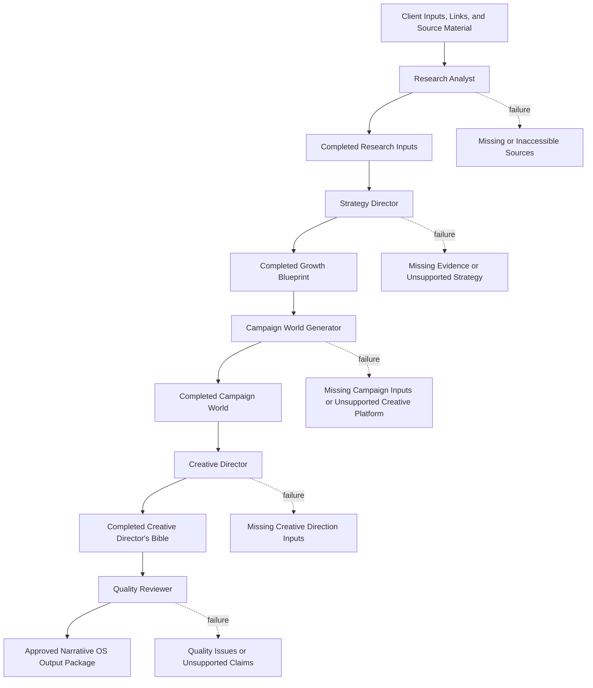

# Growth Blueprint Pipeline

<!-- AI_WORKFLOW_ID: growth_blueprint_pipeline -->
<!-- AI_WORKFLOW_VERSION: 1.0 -->
<!-- AI_ORCHESTRATION_MODE: specification_only -->
<!-- AI_AUTOMATION_STATUS: not_implemented -->

## Purpose

This workflow orchestrates the Narratiive OS pipeline from source research through strategy, campaign world development, creative direction, and quality review.

This document is an orchestration specification only. It does not implement automation, execution code, scheduling, agent routing, or tool calls.

## Pipeline Overview

1. Research Analyst
2. Strategy Director
3. Campaign World Generator
4. Creative Director
5. Quality Reviewer

## Mermaid Flowchart



## Stage 1: Research Analyst

<!-- AI_STAGE_ID: research_analyst -->
<!-- AI_AGENT_REFERENCE: agents/research_analyst.md -->

### Input

- Client inputs
- Website or context links
- Available source material
- Research objective or Strategy Director handoff scope

### Output

- Completed research inputs for `agents/strategy_director.md`
- Source inventory
- Evidence summary
- Fact and assumption register
- Market, audience, competitor, category, and cultural signals
- Growth Blueprint evidence map
- Missing evidence list

### Success Criteria

- Evidence is gathered and structured.
- Facts, assumptions, interpretations, source notes, and open questions are clearly distinguished.
- Source notes are captured for major findings.
- Market, audience, competitor, category, and cultural signals are identified where supported by sources.
- No strategic recommendations are included.
- Output is suitable for populating `templates/Growth_Blueprint.md`.

### Failure Conditions

- No client inputs, links, or source material are supplied.
- Required sources are inaccessible and no alternative material is available.
- Source material is too thin to support a useful Strategy Director handoff.
- The requested output requires unauthorized browsing or external research.
- The stage would require invented evidence, market claims, audience insights, competitor claims, proof points, or cultural trends.

### Next Agent

Strategy Director

## Stage 2: Strategy Director

<!-- AI_STAGE_ID: strategy_director -->
<!-- AI_AGENT_REFERENCE: agents/strategy_director.md -->
<!-- AI_OUTPUT_TEMPLATE: templates/Growth_Blueprint.md -->

### Input

- Completed research inputs from Research Analyst
- Blank or partially populated `templates/Growth_Blueprint.md`
- Approved supporting context explicitly supplied for strategy work

### Output

- Completed `templates/Growth_Blueprint.md`
- Strategic diagnosis
- Positioning inputs
- Narrative platform
- Activation principles
- Missing evidence list for unresolved fields

### Success Criteria

- The Growth Blueprint template structure is preserved.
- All populated fields are grounded in supplied research or approved supporting context.
- Missing evidence is identified.
- Strategic diagnosis is clear and commercially relevant.
- Positioning and narrative platform are evidence-led.
- Activation principles avoid unsupported tactical channel recommendations.
- Output is written for a founder or CMO audience.

### Failure Conditions

- Completed research inputs are missing.
- Research is mostly empty or unresolved.
- Required strategy depends on missing audience, market, product, proof, or performance evidence.
- Supplied inputs conflict and cannot be resolved from context.
- The stage would require unsupported factual claims or tactical channel recommendations.

### Next Agent

Campaign World Generator

## Stage 3: Campaign World Generator

<!-- AI_STAGE_ID: campaign_world_generator -->
<!-- AI_AGENT_REFERENCE: agents/campaign_world_generator.md -->
<!-- AI_OUTPUT_TEMPLATE: templates/Campaign_World.md -->

### Input

- Completed `templates/Growth_Blueprint.md`
- Blank or partially populated `templates/Campaign_World.md`
- Approved campaign, brand, audience, or creative context explicitly supplied for campaign world development

### Output

- Completed `templates/Campaign_World.md`
- Campaign overview
- Strategic foundation
- Campaign world premise and rules
- Creative platform
- Expression system
- Channel activation notes when supported
- Asset architecture
- Production notes and open inputs

### Success Criteria

- The Campaign World template structure is preserved.
- Campaign world content is grounded in the completed Growth Blueprint and approved context.
- The campaign purpose, audience objective, audience shift, insight, tension, opportunity, and proposition are supported by source material.
- Creative platform and expression system are specific enough for creative development.
- Channel activation and asset architecture avoid unsupported tactics.
- Missing campaign or creative inputs are identified.

### Failure Conditions

- Completed Growth Blueprint is missing.
- Growth Blueprint contains unresolved placeholders that block campaign world development.
- Required campaign, audience, offer, or creative platform evidence is missing.
- Supplied inputs conflict and cannot be resolved from context.
- The stage would require invented campaign strategy, audience insight, proposition, channel plan, or creative premise.

### Next Agent

Creative Director

## Stage 4: Creative Director

<!-- AI_STAGE_ID: creative_director -->
<!-- AI_AGENT_REFERENCE: agents/creative_director.md -->
<!-- AI_OUTPUT_TEMPLATE: templates/Creative_Directors_Bible.md -->

### Input

- Completed `templates/Campaign_World.md`
- Blank or partially populated `templates/Creative_Directors_Bible.md`
- Approved supporting brand, production, or creative context explicitly supplied for creative direction

### Output

- Completed `templates/Creative_Directors_Bible.md`
- Creative direction summary
- Creative principles
- Voice and language direction
- Visual direction
- Experience direction
- Content system
- Execution standards
- Creative evaluation criteria
- Open inputs for unresolved creative requirements

### Success Criteria

- The Creative Director's Bible template structure is preserved.
- All populated fields are grounded in the completed Campaign World or approved context.
- Missing information is identified.
- Direction is production-ready for Sora, Veo, image generation, design, copywriting, and motion.
- Output remains a creative direction source document, not a final asset pack.
- Unsupported references, claims, examples, or production requirements are not added.

### Failure Conditions

- Completed Campaign World is missing.
- Campaign World is mostly empty or unresolved.
- Required brand, product, legal, visual, or production information is missing.
- Supplied inputs conflict and cannot be resolved from context.
- The stage would require invented creative facts, references, proof points, visual identity, or production requirements.

### Next Agent

Quality Reviewer

## Stage 5: Quality Reviewer

<!-- AI_STAGE_ID: quality_reviewer -->
<!-- AI_AGENT_REFERENCE: agents/quality_reviewer.md -->

### Input

- Completed research inputs
- Completed `templates/Growth_Blueprint.md`
- Completed `templates/Campaign_World.md`
- Completed `templates/Creative_Directors_Bible.md`
- Any source material required to verify claims and evidence lineage

### Output

- Quality review report
- Pass, revise, or fail status
- Unsupported claims list
- Missing evidence list
- Template preservation check
- Cross-document consistency notes
- Required revisions by stage

### Success Criteria

- Template structure is preserved across all completed outputs.
- Claims, proof points, audience insights, positioning, channel notes, and creative direction are traceable to supplied source material.
- Facts are not confused with assumptions.
- Missing evidence and unresolved placeholders are clearly identified.
- Strategy, campaign, and creative outputs are consistent with one another.
- No stage includes recommendations or content outside its scope.
- Final package is ready for human review or client-facing refinement.

### Failure Conditions

- Required completed outputs are missing.
- Source material is unavailable for verification.
- Unsupported claims or invented facts are found.
- Template structures were altered.
- Cross-document contradictions are found.
- Missing evidence blocks approval.
- Outputs contain tactical, strategic, or creative recommendations outside the responsible stage scope.

### Next Agent

None. The pipeline ends with a reviewed Narratiive OS output package.

## YAML Workflow Contract

```yaml
workflow_id: growth_blueprint_pipeline
workflow_version: 1.0
orchestration_mode: specification_only
automation_status: not_implemented
purpose: orchestrate_research_strategy_campaign_creative_quality_review
stages:
  - stage_id: research_analyst
    order: 1
    agent: agents/research_analyst.md
    input:
      - client_inputs
      - website_or_context_links
      - available_source_material
      - research_objective_or_strategy_director_handoff_scope
    output:
      - completed_research_inputs
      - source_inventory
      - evidence_summary
      - fact_and_assumption_register
      - market_signals
      - audience_signals
      - competitor_signals
      - category_signals
      - cultural_signals
      - growth_blueprint_evidence_map
      - missing_evidence
    success_criteria:
      - evidence_gathered_and_structured
      - facts_distinguished_from_assumptions
      - source_notes_captured
      - signals_identified_when_supported
      - no_strategic_recommendations
      - suitable_for_growth_blueprint
    failure_conditions:
      - missing_source_material
      - inaccessible_required_sources
      - source_material_too_thin
      - unauthorized_external_research_required
      - invented_evidence_required
    next_agent: strategy_director
  - stage_id: strategy_director
    order: 2
    agent: agents/strategy_director.md
    output_template: templates/Growth_Blueprint.md
    input:
      - completed_research_inputs
      - blank_or_partial_growth_blueprint
      - approved_supporting_context
    output:
      - completed_growth_blueprint
      - strategic_diagnosis
      - positioning_inputs
      - narrative_platform
      - activation_principles
      - missing_evidence
    success_criteria:
      - growth_blueprint_structure_preserved
      - populated_fields_grounded_in_research
      - missing_evidence_identified
      - strategic_diagnosis_clear
      - positioning_and_narrative_evidence_led
      - unsupported_tactical_channel_recommendations_avoided
      - founder_or_cmo_ready
    failure_conditions:
      - completed_research_inputs_missing
      - research_too_empty_or_unresolved
      - required_evidence_missing
      - unresolved_input_conflicts
      - unsupported_claims_or_channel_tactics_required
    next_agent: campaign_world_generator
  - stage_id: campaign_world_generator
    order: 3
    agent: agents/campaign_world_generator.md
    output_template: templates/Campaign_World.md
    input:
      - completed_growth_blueprint
      - blank_or_partial_campaign_world
      - approved_campaign_brand_audience_or_creative_context
    output:
      - completed_campaign_world
      - campaign_overview
      - strategic_foundation
      - campaign_world_premise_and_rules
      - creative_platform
      - expression_system
      - supported_channel_activation_notes
      - asset_architecture
      - production_notes
      - open_inputs
    success_criteria:
      - campaign_world_structure_preserved
      - content_grounded_in_growth_blueprint
      - strategic_foundation_supported
      - creative_platform_specific_enough_for_development
      - unsupported_tactics_avoided
      - missing_campaign_inputs_identified
    failure_conditions:
      - completed_growth_blueprint_missing
      - blocking_growth_blueprint_placeholders
      - required_campaign_or_creative_evidence_missing
      - unresolved_input_conflicts
      - invented_campaign_or_creative_content_required
    next_agent: creative_director
  - stage_id: creative_director
    order: 4
    agent: agents/creative_director.md
    output_template: templates/Creative_Directors_Bible.md
    input:
      - completed_campaign_world
      - blank_or_partial_creative_directors_bible
      - approved_brand_production_or_creative_context
    output:
      - completed_creative_directors_bible
      - creative_direction_summary
      - creative_principles
      - voice_and_language_direction
      - visual_direction
      - experience_direction
      - content_system
      - execution_standards
      - creative_evaluation_criteria
      - open_inputs
    success_criteria:
      - creative_directors_bible_structure_preserved
      - populated_fields_grounded_in_campaign_world
      - missing_information_identified
      - production_ready_for_sora_veo_and_image_generation
      - remains_creative_direction_source_document
      - unsupported_creative_content_avoided
    failure_conditions:
      - completed_campaign_world_missing
      - campaign_world_too_empty_or_unresolved
      - required_brand_product_legal_visual_or_production_information_missing
      - unresolved_input_conflicts
      - invented_creative_content_required
    next_agent: quality_reviewer
  - stage_id: quality_reviewer
    order: 5
    agent: agents/quality_reviewer.md
    input:
      - completed_research_inputs
      - completed_growth_blueprint
      - completed_campaign_world
      - completed_creative_directors_bible
      - verification_source_material
    output:
      - quality_review_report
      - pass_revise_or_fail_status
      - unsupported_claims_list
      - missing_evidence_list
      - template_preservation_check
      - cross_document_consistency_notes
      - required_revisions_by_stage
    success_criteria:
      - template_structures_preserved
      - claims_traceable_to_sources
      - facts_not_confused_with_assumptions
      - missing_evidence_identified
      - documents_consistent
      - stage_scopes_preserved
      - ready_for_human_review_or_client_refinement
    failure_conditions:
      - required_outputs_missing
      - verification_sources_unavailable
      - unsupported_claims_or_invented_facts_found
      - template_structures_altered
      - cross_document_contradictions_found
      - missing_evidence_blocks_approval
      - stage_scope_violations_found
    next_agent: null
handoff_rules:
  - do_not_implement_automation_from_this_spec
  - each_stage_must_preserve_referenced_template_structure
  - each_stage_must_use_supplied_or_authorized_context_only
  - unresolved_inputs_must_be_carried_forward
  - unsupported_claims_must_be_flagged_not_repaired_by_invention
final_output_package:
  - completed_research_inputs
  - templates/Growth_Blueprint.md
  - templates/Campaign_World.md
  - templates/Creative_Directors_Bible.md
  - quality_review_report
```
